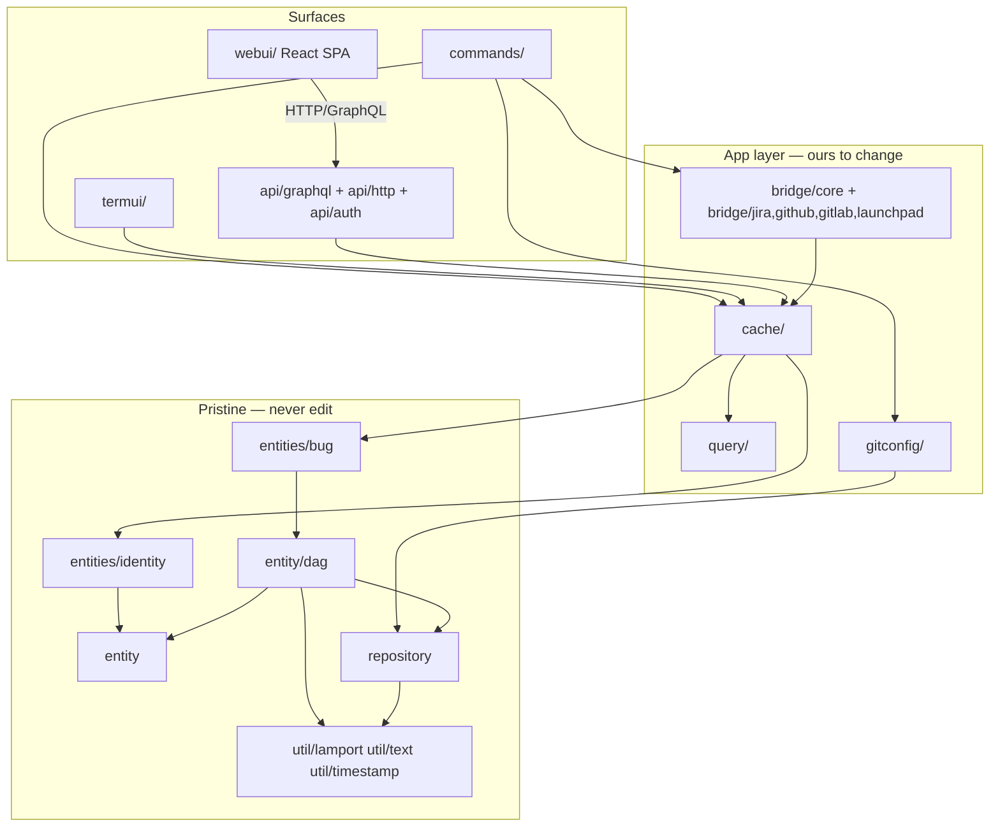
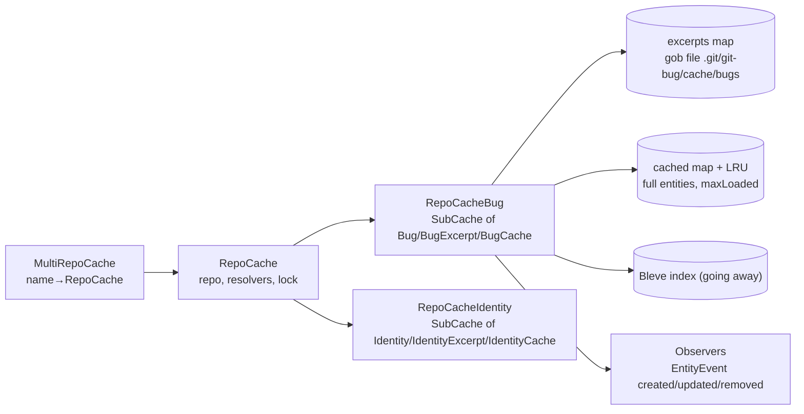
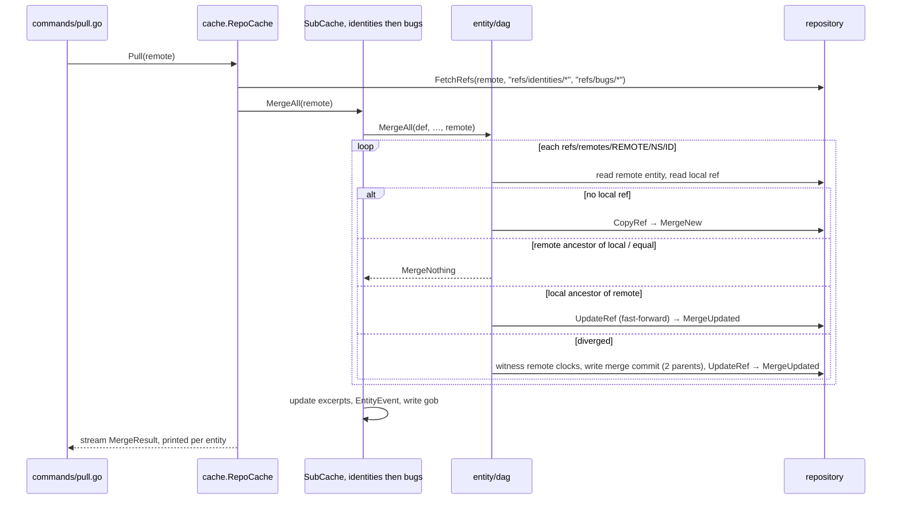
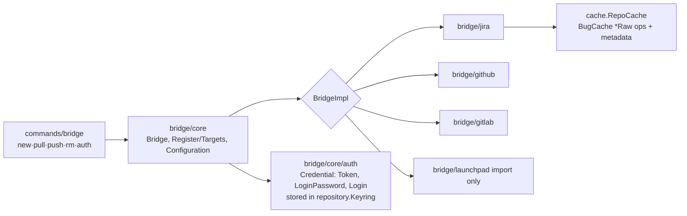
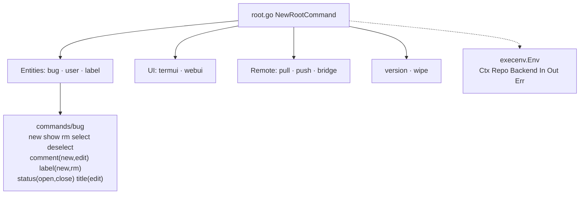

# MAP — territory map of git-work

Orientation only; not a spec.
For rationale and detail: `AGENTS.md` (direction, boundaries),
`doc/design/architecture.md`, `doc/design/data-model.md`,
`doc/design/bridges/jira.md`, and the tracker itself (`git work bug`).

Fork of git-bug at `e1c21a42`. Go module path is still `github.com/git-bug/git-bug`.
Fork-only code so far: `gitconfig/`, `cache/user_identity.go`, a few lines in `commands/execenv/loading.go`.

## 1. Layers



Note: `entities/bug` is **not** in the pristine seven and is the thing
being generalized into `issue`. `entities/common` (Status, Label) is also ours.

## 2. Top-level modules

### `entity/` — pristine — entity primitives
- `Id` (sha of first op pack, `DeriveId`), `CombinedId` (bug id ⧺ comment id, `id_interleaved.go`).
- `Interface` (`Id()`, `Validate()`), `Resolvers` map + `Resolve[T]` generic lookup, `CachedResolver`.
- `MergeResult`/`MergeStatus` (New, Updated, Nothing, Invalid, Error) streamed from merges.
- `StreamedEntity[T]` for `ReadAll` channels; typed errors `ErrNotFound`, `ErrMultipleMatch`, `ErrInvalidFormat`.

### `entity/dag/` — pristine — op-based CRDT engine
- `Definition{Typename, Namespace, OperationUnmarshaler, FormatVersion}` specializes the engine per entity type.
- `Entity`: committed `ops`, `staging` ops, `lastCommit`, two Lamport times (create, edit).
- `Operation` interface + `OpBase` (type, author, unix time, nonce, metadata); `OperationWithApply[Snap]`, `OperationWithFiles`, `Snapshot`.
- Actions (generic over wrapper): `Read`, `ReadAll`, `Fetch`, `Push`, `Pull`, `MergeAll`, `Remove`, `RemoveAll`, `ListLocalIds`.
- Storage layout per commit tree: `ops` blob (JSON op pack), `version-N`, `create-clock-N`, `edit-clock-N`, optional `extra/` tree for file hashes. One ref per entity: `refs/<ns>/<id>`. Remote copies under `refs/remotes/<remote>/<ns>/<id>`.
- Consumed: `repository.ClockedRepo`, `identity.Interface`, `lamport`.

### `repository/` — pristine — git storage abstraction
- `Repo` = `RepoConfig` + `RepoKeyring` + `RepoCommon` + `RepoStorage` + `RepoIndex` + `RepoData` + `RepoBrowse`; `ClockedRepo` adds `RepoClock`.
- `RepoData`: blobs/trees/commits, refs (`UpdateRef`, `ListRefs`, `CopyRef`), `FetchRefs`/`PushRefs`, `ListCommits`.
- `RepoClock`: named persisted Lamport clocks under `.git/git-bug/clocks/`.
- `RepoBrowse`: read-only browse of the code repo (branches, tree, blob, log, diff) for the webui.
- `LocalStorage` = billy FS rooted at `.git/git-bug/` (cache files, lock, clocks).
- `Index` (Bleve, `index_bleve.go`) — slated for removal (decision `3500366`).
- Impl: `GoGitRepo` (go-git); `mock_repo.go` for tests. `Config`/`ConfigRead` read git config via go-git (see `gitconfig/` override).

### `entities/identity/` — pristine — who
- `Identity` with versioned history (`version.go`), keys (`key.go`, PGP signing), `Mutator`.
- User binding via git config `git-bug.identity`: `SetUserIdentity`, `GetUserIdentity`, `IsUserIdentitySet`, `NewFromGitUser`.
- Own actions `Fetch/Push/Pull/MergeAll/Remove`; refs `refs/identities/<id>`; `identity_stub.go` for lazy resolution.

### `entities/bug/` — ours (to become `issue`) — the tracked thing
- `Bug` wraps `dag.Entity`; `Typename "bug"`, `Namespace "bugs"` (→ `refs/issues`, `be69e67`), `formatVersion 4`.
- Ops (`OperationType` iota): `Create`, `SetTitle`, `AddComment`, `SetStatus`, `LabelChange`, `EditComment`, `NoOp`, `SetMetadata`. Each `op_*.go` = struct + `Apply(*Snapshot)` + `Validate` + constructor `bug.X(entity, author, time, …)`.
- `Snapshot`: Status, Title, Comments, Labels, Author, Actors, Participants, CreateTime, `Timeline []TimelineItem`, `Operations`.
- `SimpleResolver`, `sorting.go`, thin `bug_actions.go` delegating to `dag`.

### `entities/common/` — ours — `Status` (open/closed), `Label` (+ color).

### `cache/` — ours — in-memory + on-disk cache, the mutation API
See §3.1.

### `query/` — ours — bug query language
- `Query{Search, Filters, OrderBy, OrderDirection}`; `Filters`: status, author, actor, participant, label, title, metadata, no-label.
- `lexer.go` → `parser.go` → `Query`. Consumed by `cache.RepoCacheBug.Query`, CLI `bug [QUERY]`, GraphQL `allBugs(query)`. Docs: `doc/usage/query-language.md`.

### `gitconfig/` — ours (fork, `68abc13`) — git-CLI-backed config
- `WrapRepo(repo, dir) ClockedRepo` decorates a repo so `LocalConfig/GlobalConfig/AnyConfig` shell out to `git config -z --includes …`, honoring `[include]`/`[includeIf]` that go-git ignores.
- Wired in `execenv.LoadRepo`; falls back to go-git if `git` is missing.

### `commands/` — ours — cobra CLI
See §3.3.

### `bridge/` — ours — external tracker sync
See §3.2.

### `api/` — ours — HTTP surface for the webui
- `api/graphql`: gqlgen. `schema/*.graphql` → generated `graph/*.generated.go` + `models/gen_models.go`; hand-written `resolvers/*.go` over `cache.MultiRepoCache`. `NewHandler(mrc, errOut, dev)`; `subscription.go` streams `cache.Observer` entity events.
- `api/http`: `/gitfile/{repo}/{path}` blob read; upload handler (auth-gated).
- `api/auth`: fixed-user middleware (`Middleware(userId)`), `RequireAuth`, `UserFromCtx`.

### `termui/` — ours (to be rewritten in Bubble Tea, `84dfbde`) — gocui TUI
- `Run(cache)`; windows: `bugTable`, `showBug`, `labelSelect`, `inputPopup`, `msgPopup`, `helpBar`. Holds the store lock while open.

### `webui/` — ours — React/Vite SPA
- `src/routes` (TanStack router, `$repo` scoped), `src/components/{bugs,code,content,layout,shared,ui}`, `src/lib/{apollo,auth,theme}`, `src/__generated__` from `codegen.ts` reading `api/graphql/schema/*.graphql`.
- Go side: `handler.go` serves `dist/` embedded via `assets.go` (`//go:build webui`); `assets_stub.go` otherwise. `make build-webui` runs pnpm.

### `util/` — helpers
- Pristine: `lamport` (Clock, MemClock, PersistedClock), `text` (validate/transform), `timestamp`.
- Ours: `colors`, `interrupt` (cleaner registry), `multierr`, `process.IsRunning` (stale-lock check).

### Support
- `main.go` → `commands.NewRootCommand`; `version.go` (ldflags `main.version`).
- `doc/`: `design/` (architecture, data-model, cli-convention, bridges/jira), `usage/`, generated `man/` + `md/` via `doc/generate.go`, `feature-matrix.md`.
- `misc/`: shell completions, `git_hooks/prepare-commit-msg`, `random_bugs` fixture generator (used by `tests/read_bugs_test.go`).
- `Makefile`: `build` (webui + go), `install`, `test`, `secure`, `clean-*-bugs/identities`.

## 3. Key modules, one layer deeper

### 3.1 `cache/`



- `RepoCache` (`repo_cache.go`): opens `.git/git-bug/lock` (pid; stale-lock cleanup via `process.IsRunning`), builds subcaches, exposes `Bugs()`, `Identities()`, `Close()`. `NewRepoCache` streams `BuildEvent`s (Started/Progress/Finished/CacheIsBuilt/RemoveLock) so the CLI can draw a progress bar.
- `repo_cache_common.go`: repo passthroughs (config, keyring, remotes), `Fetch/Push/Pull/MergeAll` (merges identities first, then bugs), user identity get/set/clear.
- `user_identity.go` (fork, `828c228`): `EnsureUserIdentity()` → configured | adopted-by-email | created-from-git-user.
- `SubCache[EntityT, ExcerptT, CacheT]` (`subcache.go`): generic engine behind both subcaches.
  - `Load()` gob-decodes excerpts, rejects on `Version` mismatch → `Build()` re-reads every ref via `ReadAllWithResolver`, indexes, `write()`s.
  - `Resolve*(id|prefix|matcher)` → full entity from LRU or disk; `ResolveExcerpt*` → cheap.
  - `entityUpdated(id)` callback (passed into every `BugCache`): notify observers → refresh excerpt → reindex → rewrite gob. Fails hard if the entity was evicted (avoids split-brain writes).
  - `MergeAll(remote)` wraps `dag.MergeAll`, updates excerpts, emits `EntityEvent`s.
- `RepoCacheBug` (`bug_subcache.go`): `Query(*query.Query)` = filter excerpts via `Matcher`/`Filter` (`filter.go`) + sort; `New/NewWithFiles/NewRaw`; `ResolveComment`, `ResolveBugCreateMetadata` (bridges look up by `<target>-id` metadata); `ValidLabels`.
- `BugCache` (`bug_cache.go`): one method per op, each with a `Raw` variant taking author/time/metadata (used by bridges): `AddComment`, `ChangeLabels`, `ForceChangeLabels`, `Open`, `Close`, `SetTitle`, `EditComment`, `EditCreateComment`, `SetMetadata`. Pattern: lock → `bug.X(entity,…)` appends op → unlock → `notifyUpdated()`. `Commit()`/`CommitAsNeeded()` from `CachedEntityBase` persist.
- `BugExcerpt` (`bug_excerpt.go`): the list-view projection (status, title, labels, author id, times, comment count, metadata). Sorters `BugsById/ByCreationTime/ByEditTime`.

Mutation path (e.g. `git work bug status close <id>`):

```mermaid
sequenceDiagram
  participant CLI as commands/bug
  participant RC as cache.RepoCache
  participant BC as cache.BugCache
  participant B as entities/bug
  participant DAG as entity/dag.Entity
  participant R as repository / go-git
  CLI->>RC: LoadBackendEnsureUser → lock, Load/Build caches, EnsureUserIdentity
  CLI->>RC: Bugs().ResolvePrefix(id)
  RC-->>CLI: *BugCache
  CLI->>BC: Close()
  BC->>B: bug.Close(entity, author, now, meta)
  B->>DAG: Append(SetStatusOp)
  BC->>RC: entityUpdated → excerpt, index, gob write, observers
  CLI->>BC: Commit()
  BC->>DAG: Commit(repo)
  DAG->>R: Increment bugs-edit clock; StoreData(ops JSON); StoreTree; StoreCommit(parent=lastCommit)
  DAG->>R: UpdateRef(refs/bugs/ID, commit)
  CLI->>RC: Close() → release lock
```

Sync path (`git work pull`):



### 3.2 `bridge/`



- `core.BridgeImpl`: `Target()`, `NewImporter()`, `NewExporter()`, `Configure(repo, params, interactive)`, `ValidParams()`, `ValidateConfig()`, `LoginMetaKey()`. Registered via `init()` → `core.Register`.
- `core.Importer.ImportAll(ctx, repo, since) <-chan ImportResult`; `core.Exporter.ExportAll(ctx, repo, since) <-chan ExportResult`. Events: Bug, Comment, CommentEdition, StatusChange, TitleEdition, LabelChange, Identity, Nothing, Warning, RateLimiting, Error.
- `core.Bridge` (`bridge.go`): per-name config in git config `git-bug.bridge.<name>.*`; `ImportAllSince` persists `lastImportTime`; `ExportAll(since)`.
- Idempotency contract (all bridges): every imported op carries `<target>-id` metadata; re-import looks up `ResolveBugCreateMetadata` / existing op metadata before creating. Export marks ops with `<target>-id` metadata after the remote accepts them (Jira also `jira-export-time`).
- `bridge/jira` (the first-class backend; current code is upstream's):
  - `client.go`: REST client (session/token auth), `Search/IterSearch`, `GetIssue`, `IterComments`, `IterChangeLog`, `CreateIssue`, `UpdateIssueTitle/Body`, `AddComment/UpdateComment`, `UpdateLabels`, `GetTransitions/DoTransition`, `GetServerTime`.
  - `import.go`: `ImportAll` = search project since → `ensurePerson` (identity per Jira user) → `ensureIssue` → `ensureComment` → `ensureChange` (changelog entries → status/title/label ops, using a configurable `status map`). Derived ids for sub-items (`getTimeDerivedID`, `getIndexDerivedID`).
  - `export.go`: `exportBug` walks ops not yet marked exported: create issue, comments, title, labels, status transitions; `markOperationAsExported`.
  - Target state (`3c6d07a`): bidirectional, 3-way per field, Jira wins on double edit — not yet implemented here.
- `bridge/github`: GraphQL client + `importMediator` (rate-limit aware paging), `export_mutation.go`. `bridge/gitlab`: REST + `parser/` for event text. `bridge/launchpad`: import only.

### 3.3 `commands/`



- `execenv/`: `Env` holds the open `repository.ClockedRepo` and `cache.RepoCache`; `In/Out` abstract terminal (`PrintJSON`, `IsTerminal`, `Width`). Pre-run hooks: `LoadRepo` (go-git open + `gitconfig.WrapRepo`), `LoadBackend` (opens cache, progress bar from `BuildEvent`s), `*EnsureUser` variants (`EnsureUserIdentity`), `CloseBackend` wrapper (releases lock even on error).
- `commands/bug`: `bug [QUERY]` lists via `query.Parse` → `Bugs().Query`; subcommands mutate through `BugCache`. `cmdjson/` = stable JSON shapes (`BugSnapshot`, `BugExcerpt`, `Identity`, `Time`). `select/` = implicit "selected bug" stored in local storage per namespace. `input/` = `$EDITOR` launch + prompts. `testenv/` + `cmdtest/` for command tests.
- `commands/bridge`: `new` (interactive `Configure`), `pull`/`push` (stream results to stdout), `rm`, `auth {add-token,show,rm}`.
- `pull.go`/`push.go` → `Backend.Pull/Push`. `webui.go` builds the mux (auth middleware, `/graphql`, `/playground`, `/gitfile/…`, SPA fallback) over a `MultiRepoCache`. `termui.go` → `termui.Run`. `wipe.go` → `RemoveAll` of all entities.
- Planned (not yet present): `git work issue *` agent-first plumbing (JSON out, JSON Patch in, `e8d6426`); `git work flow *` porcelain (`b511c63`).

## 4. Where state lives

| What | Where |
| --- | --- |
| Entities (ops) | git objects; refs `refs/bugs/<id>`, `refs/identities/<id>`; remote mirrors `refs/remotes/<r>/…` |
| Lamport clocks | `.git/git-bug/clocks/<ns>-create`, `<ns>-edit` (also embedded in each commit tree) |
| Excerpt cache | `.git/git-bug/cache/<ns>` (gob; versioned, rebuilt on mismatch) |
| Search index | `.git/git-bug/indexes/<ns>` (Bleve; being dropped) |
| Process lock | `.git/git-bug/lock` (pid) |
| Selected bug | `.git/git-bug/select/<ns>` |
| User identity id | git config `git-bug.identity` |
| Bridge config | git config `git-bug.bridge.<name>.*` |
| Credentials | OS keyring / file keyring via `repository.Keyring` |
| Webui build | `webui/dist` embedded only with `-tags webui` |

## 5. Codegen and build tags

- GraphQL: edit `api/graphql/schema/*.graphql` → `go generate ./api/graphql` (gqlgen, `gqlgen.yml`) → `graph/`, `models/gen_models.go`; webui `pnpm codegen` → `src/__generated__`.
- Docs and completions: `go generate` at root (`main.go`) runs `doc/generate.go` → `doc/man`, `doc/md`, and `misc/completion/generate.go`.
- `webui` tag gates asset embedding; default `go build -o git-work .` is CLI-only.
